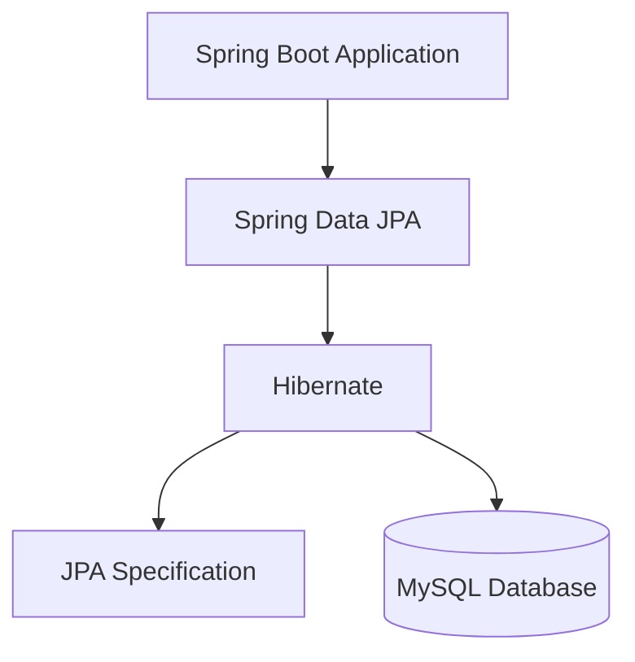

# 📚 Understanding JPA, Hibernate, and Spring Data JPA

---

## 🎯 Purpose

This document explains the differences between **JPA**, **Hibernate**, and **Spring Data JPA**, how they work together, and why they are commonly used in Spring Boot applications.


---

# 📖 Why Do We Need Them?

Modern applications constantly interact with databases. Writing SQL statements manually for every operation can make applications difficult to maintain.

To solve this problem, Java provides technologies that map Java objects directly to database tables. This concept is called **Object Relational Mapping (ORM)**.

Three technologies play an important role in this process:

- JPA
- Hibernate
- Spring Data JPA

Although they are closely related, each serves a different purpose.

---

# ☕ Java Persistence API (JPA)

Java Persistence API (JPA) is a **Java specification** that defines a standard approach for storing Java objects in relational databases.

It provides a common set of annotations, interfaces, and rules that every ORM framework should follow.

JPA itself **does not perform any database operations**. Instead, it describes how persistence should work.

Some important JPA annotations include:

| Annotation | Purpose |
|------------|---------|
| `@Entity` | Declares a persistent Java class |
| `@Table` | Maps the class to a database table |
| `@Id` | Specifies the primary key |
| `@Column` | Maps a field to a table column |

JPA also introduces the **EntityManager**, which performs CRUD operations on entities.

---

# 🐘 Hibernate

Hibernate is one of the most popular **ORM frameworks** available for Java.

It implements the JPA specification and provides the actual logic required to communicate with the database.

When an application calls a JPA method, Hibernate generates the required SQL statements and executes them.

Hibernate provides many advanced features such as:

- Automatic SQL generation
- Entity caching
- Lazy loading
- Relationship mapping
- Schema generation
- HQL (Hibernate Query Language)

Because Hibernate implements JPA completely, it is the default ORM framework used in most Spring Boot projects.

---

# 🌱 Spring Data JPA

Spring Data JPA is a Spring module that simplifies database programming even further.

Instead of writing DAO classes or using EntityManager directly, developers only need to create repository interfaces.

Spring automatically generates the implementation during application startup.

Example:

```java
public interface EmployeeRepository extends JpaRepository<Employee,Integer> {
}
```

Without writing any SQL, the following methods become available automatically:

- save()
- findAll()
- findById()
- delete()
- count()

Spring Data JPA dramatically reduces boilerplate code and improves developer productivity.

---

# 🔄 Relationship Between Them

The relationship between these technologies can be understood using the following architecture.



### Explanation

- JPA defines the rules.
- Hibernate follows those rules.
- Spring Data JPA makes Hibernate easier to use.
- Hibernate communicates with the database.

---

# 📊 Comparison

| Feature | JPA | Hibernate | Spring Data JPA |
|----------|-----|-----------|-----------------|
| Type | Specification | ORM Framework | Spring Library |
| Performs database operations | ❌ | ✅ | ✅ |
| Reduces coding effort | ❌ | Moderate | Excellent |
| SQL generation | ❌ | ✅ | ✅ |
| Repository support | ❌ | ❌ | ✅ |
| CRUD methods | ❌ | Manual | Automatic |
| Transaction support | Standard | Yes | Yes |

---

# 💻 Hibernate Example

```java
Session session = factory.openSession();

Transaction tx = session.beginTransaction();

session.save(employee);

tx.commit();

session.close();
```

### Explanation

1. A Hibernate Session is opened.
2. A transaction is started.
3. The Employee object is saved.
4. The transaction is committed.
5. Finally, the session is closed.

Although Hibernate provides complete control, it requires writing additional code.

---

# 💻 Spring Data JPA Example

```java
@Autowired
EmployeeRepository repository;

@Transactional
public void saveEmployee(Employee employee){

    repository.save(employee);

}
```

### Explanation

Spring Data JPA internally calls Hibernate to execute the SQL statement.

The developer only needs one line:

```java
repository.save(employee);
```

No manual session handling is required.

---

# ✅ Advantages

## JPA

- Standard API
- Database independent
- Portable code
- Easy migration between providers

---

## Hibernate

- Powerful ORM framework
- Automatic SQL generation
- Excellent caching support
- Supports HQL
- Better performance tuning

---

## Spring Data JPA

- Less boilerplate code
- Automatic repository implementation
- Easy CRUD operations
- Pagination and sorting support
- Seamless Spring Boot integration

---

# ⚠ Limitations

### JPA

- Only defines standards
- Needs an implementation

### Hibernate

- Requires configuration
- Can become complex in large projects

### Spring Data JPA

- Less control over generated queries
- Developers should understand Hibernate internally

---

# 🏢 Real-Life Example

Imagine building a house.

🏗 **JPA**

Acts like the construction blueprint. It specifies what needs to be done but doesn't build anything.

👷 **Hibernate**

Acts like the construction workers who build the house according to the blueprint.

👨‍💼 **Spring Data JPA**

Acts like the project manager who coordinates the workers and simplifies the entire construction process.

---

# 💡 Best Practices

- Use Spring Data JPA for most CRUD applications.
- Learn JPA annotations before exploring Hibernate features.
- Place `@Transactional` in the service layer.
- Enable SQL logging while learning.
- Use repository interfaces instead of writing unnecessary DAO classes.
- Optimize queries to avoid performance issues.

---

# 📝 Summary

| Technology | Responsibility |
|------------|----------------|
| JPA | Defines persistence standards |
| Hibernate | Implements JPA and performs ORM |
| Spring Data JPA | Simplifies data access using repositories |

---

# 🎯 Conclusion

JPA, Hibernate, and Spring Data JPA are not competing technologies—they complement one another.

JPA provides the standard specification, Hibernate implements that specification, and Spring Data JPA offers a higher-level abstraction that minimizes repetitive coding.

In modern Spring Boot applications, developers typically use **Spring Data JPA** with **Hibernate** as the underlying JPA provider. This combination offers faster development, cleaner code, and easier database management while still allowing access to Hibernate's advanced capabilities whenever required.